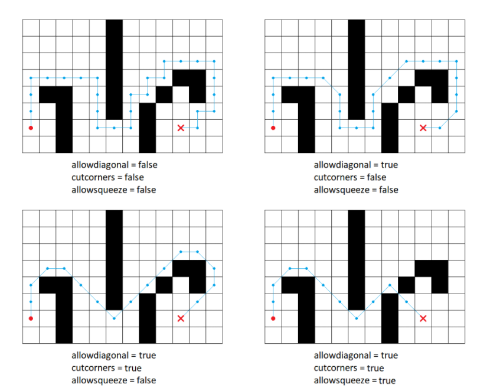

# PathPlanningProject
## Description
Project in development...
## Installing

Download current repository to your local machine. Use

```
git clone https://github.com/Ch0p1k3/PathPlanningAlgorithms
```

## Input and output
### Input files

Input files are an XML files with a specific structure.
Input file should contain:
* Mandatory tag "root". It describes the parameters.
  * Tag "map". It describes the map.
    * "width" - the width of the field.
    * "height" - the height of the field.
    * "cellsize" - the size of ceil.
    * "startx" - the start coordinate x.
    * "starty" - the start coordinate y.
    * "finishx" - the finish coordinate x.
    * "finishy" - the finish coordinate y.
    * Coordinates are non-negative. The top left corner has coordinates (0, 0). The first coordinate changes by rows, the second by columns.
    * Tag "grid" describes your map, where each line is separated by a "line" tag. "0" is free cell, "1" is obstruction.
  * Tag "algorithm" describes the algrithm options.
    * "searchtype" - the type of the search. Arguments are "dijkstra" or "astar". Dijkstra and A* algorithm, respectively.
    * "metrictype" - the heuristic for A* algorithm. There are: "diagonal", "manhattan", "euclidean", "chebyshev".
    * breakingties - determines the order of opening the vertices when the value of f is equal. There are "g-min" or "g-max".
    * "hweight" - the hweight value for A* algorithm. For "hweight" = 1 we have classical A*, for >1 is weighted A*(WA*).
    * "allowdiagonal" - it is allowed to walk diagonally (true or false). If false, then you can only walk horizontally/vertically.
    * "cutcorners" - it is allowed to walk diagonally if there is an obstacle nearby. Also true or false.
    * "allowsqueeze" - it is allowed to walk diagonally if there are obstacles on both sides. Also true or false.
    
  * Tag "options". It is options for the output.
    * "loglevel" - the value of the output. There are "0.5" and "1". "1" is more verbose output.
    * "logpath" - the path of the output.
    * "logfilename" - the name of the output file.
    
### Output files
* "log" - output
  * An important tag is "summary". His attributes:
    * "numberofsteps" - the number of steps of the algorithm.
    * "nodescreated" - the number of nodes created during the search.
    * "length" - the path length.
    * "length_scaled" = "length" * "cellsize"
    * "time" - running time of the algorithm.
  * "path" - the map of the output(only for 1 "loglevel").
  * "lplevel" - the path of the coordinates.
  * "hplevel" - the short path of the coordinates.

## Getting started

To build and run the project you should have compiler on C++17 standart.

The project can be build in two ways:
- Using QtCreator and qmake;
- Using CMake;
When using QtCreator, you need to open the file `ASearch.pro` which is located in the directory` .../PathPlanningProject/Src/ `and set up the project with the required assembly kit.


After selecting a project, you need to set the input file name as a command line argument. Use the file `.../ PathPlanningProject/Examples/example.xml` as a first example. To set command line arguments, go to the project launch settings and enter the desired file path in the "Command line parameters" field.


When using CMake, building and launching can be done both from the command line and using various IDEs. Below are the build and run scripts using the command line.

### Linux и Mac
Release building:
```bash
cd PathPlanningProject
cmake -DCMAKE_BUILD_TYPE="Release"
make
make install
```

Debug building:
```bash
cd PathPlanningProject
cmake -DCMAKE_BUILD_TYPE="Debug"
make
make install
```

Launching:
```bash
cd .Bin/{Debug|Release}/
./Ivan_Luchsh_ASearch ../../Examples/example.xml
```

### Windows
Release building:
```cmd
cd PathPlanningProject
set PATH
cmake -DCMAKE_BUILD_TYPE="Release" -G "MinGW Makefiles"
mingw32-make
mingw32-make install
```

Debug building:
```cmd
cd PathPlanningProject
set PATH
cmake -DCMAKE_BUILD_TYPE="Debug" -G "MinGW Makefiles"
mingw32-make
mingw32-make install
```

Launching:
```cmd
cd Bin/{Debug|Release}/
Ivan_Luchsh_ASearch.exe ../../Examples/example.xml
```
 
Tests are run from the directory `.../PathPlanningProject` using the command:
```
ctest -C {Debug|Release}
```

For more detailed output:
```
ctest -C {Debug|Release} --output-on-failure
```

## Mentors
**Яковлев Константин Сергеевич**
- kyakovlev@hse.ru
- [HSE website](https://www.hse.ru/staff/yakovlev-ks)
- Telegram: @KonstantinYakovlev

**Дергачев Степан**
- sadergachev@edu.hse.ru
- Telegram: @haiot4105

## Me
**Luchsh Ivan**
- Telegram: @ch0p1k3
